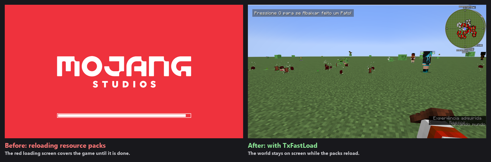

# TxFastLoad for NeoForge 1.21.1

A NeoForge 1.21.1 port of [TxFastLoad](https://modrinth.com/mod/txfastload) by txslx. The original is a Fabric mod for Minecraft 1.21.11 and 26.1.2. This port is published with the author's permission, and all credit for the idea and the original mod goes to txslx.

Client only. Don't put it on a dedicated server.

## What it does

- **Faster resource packs.** Zip resource packs are indexed once instead of being rescanned on every lookup. The more packs you run, the more this saves.
- **No loading screen on reloads.** Pressing F3+T, changing packs or joining a server with its own pack keeps the screen or the world visible, with a thin progress line at the top.
- **No fades.** The fade when the game finishes starting and the 2 second fade-in on the title screen are gone.
- **Server packs.** An unchanged server resource pack is not checked again when you rejoin, and the "Reconfiguring..." screen is replaced by the last frame.
- **Optional:** hide the "Loading terrain" screen. Off by default, since it saves no time on 1.21.1.

Every feature has its own switch in `config/txfastload-client.toml`.

## How much it saves

Measured in CrazyCraft 5.0 (about 200 mods and 29 resource packs):

| | Without | With |
|---|---:|---:|
| Reload on the title screen, until usable | 18.6 s | 13.4 s |
| Reload in a world, until usable | 25.3 s | 19.7 s |
| Start-up: loading done to a usable title screen | 2.0 s | 0.4 s |
| Applying a 64 MB server pack | 16 to 20 s | 11 to 13 s |

World joins and dimension changes take the same time as before.

## Install

1. Download `txfastload-neoforge-1.21.1-1.0.0.jar` from the [releases page](https://github.com/CoolFreeze23/txfastload-neoforge/releases).
2. Put it in the client's `mods` folder. It needs NeoForge 21.1.x on Minecraft 1.21.1 and nothing else.

Don't run it together with QuickPack, Remove Reloading Screen or Force Close Loading Screen: they change the same screens.

## Known quirks

- With a custom title screen (FancyMenu), menu images can appear a moment after the buttons, because the fade that used to hide that is gone.
- The server reconfiguration freeze has not been tried behind a real proxy yet.

## Credits and licence

TxFastLoad is made by txslx: [modrinth.com/mod/txfastload](https://modrinth.com/mod/txfastload). All rights reserved. This NeoForge port is shared with the author's permission; please ask txslx before re-uploading it anywhere else.
